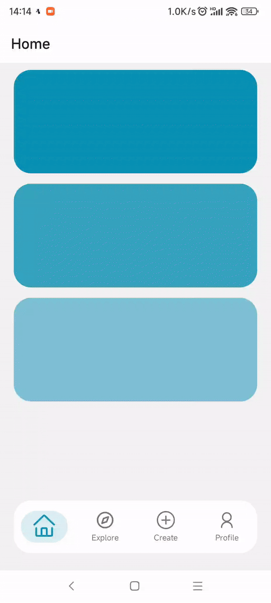

# Custom Tabs

This is an [Expo](https://expo.dev) project created with [`create-expo-app`](https://www.npmjs.com/package/create-expo-app).

source: [Custom Tab Navigation in Expo Router | React Native Tutorial | Part 1](https://www.youtube.com/watch?v=K6OJP0s5VDQ)

preview:  


## Get started

1. Install dependencies

   ```bash
   npm install
   ```

2. Start the app

   ```bash
    npx expo start
   ```
